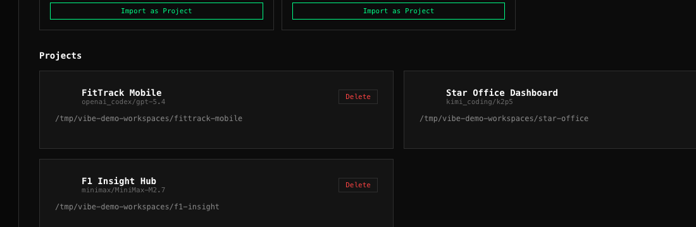
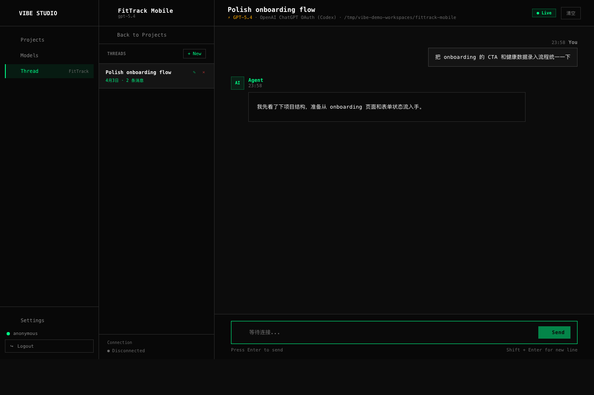
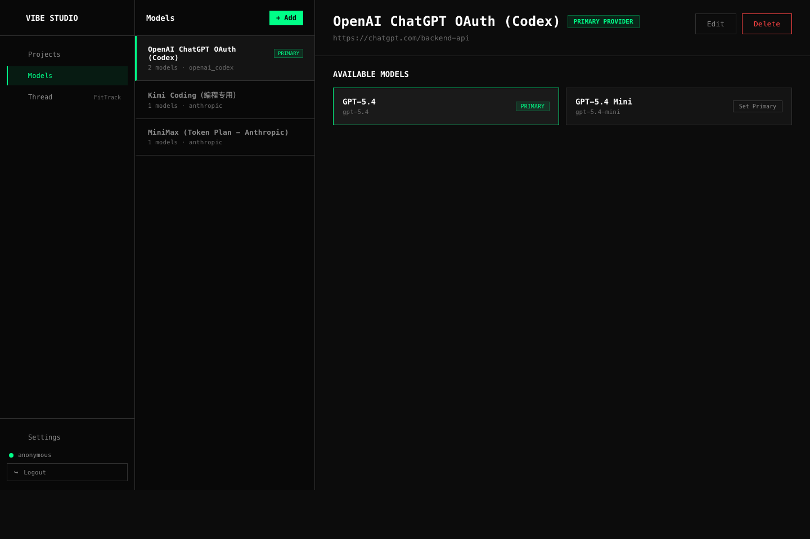

# Vibe Studio

🎵 一个支持多模型切换的 AI 编程助手，基于 React + FastAPI 构建。


## 功能特性

- 🤖 **多模型支持**: OpenAI, Anthropic Claude, Google Gemini, Moonshot Kimi, DeepSeek, MiniMax, 智谱 AI 等
- 💬 **线程级模型切换**: 每个对话可独立选择模型，默认跟随主模型
- 🧵 **Thread 持续上下文**: 对话按线程保存，信息不断档，换设备回来也能接着写
- 🔧 **内置工具**: 文件读写、代码搜索、命令执行、智能替换
- 🔄 **AI 工具发现**: 自动检测 OpenClaw, Codex, Claude Code 等已安装的 AI CLI 工具
- 📁 **项目管理**: 支持多项目、本地目录选择
- 🔐 **JWT 认证**: 安全的登录机制，支持环境变量配置

## 为什么适合 Vibe Coding

和只适合“坐在当前这台电脑前”使用的 CLI 相比，Vibe Studio 更适合连续、跨设备的编程流：

- 项目、线程、模型选择都保存在本地工作台里，不容易因为切换窗口或切换设备丢上下文
- 线程模式更适合长期任务，可以围绕同一个项目持续推进，而不是每次重新解释背景
- 配合 Cloudflare Tunnel 后，你在外面也能从手机、平板、另一台电脑继续同一个 coding thread

## 界面预览

### 项目工作台



### Thread 工作区



### 多模型管理



## 快速开始

当前稳定支持的平台：

- macOS：已验证可安装、可启动，并提供 `launchd` 常驻服务脚本
- Linux / Windows：核心应用理论可运行，但安装流程、守护启动和兼容性尚未完整验证，暂不作为正式支持平台

### 方式一：macOS 一条命令安装（推荐）

```bash
/bin/bash -c "$(curl -fsSL https://raw.githubusercontent.com/txyelva/vibe-studio/main/scripts/bootstrap-macos.sh)"
```

这条命令会自动：

- 克隆或更新仓库到 `~/vibe-studio`
- 创建虚拟环境
- 安装 Python 依赖
- 构建前端
- 安装并启动 macOS `launchd` 常驻服务

安装完成后服务会自动运行在 `http://127.0.0.1:7788/`。

### 方式二：仓库内快速安装

如果你已经手动克隆了仓库，可以在仓库目录里运行：

```bash
git clone https://github.com/txyelva/vibe-studio.git
cd vibe-studio
./scripts/install-macos.sh
```

### 方式三：通用手动安装

```bash
# 1. 创建虚拟环境
python3 -m venv .venv
source .venv/bin/activate  # Windows: .venv\Scripts\activate

# 2. 安装依赖
pip install -e .

# 3. 构建前端（可选）
cd react && npm install && npm run build && cd ..

# 4. 启动服务
vibe-studio
```

访问 http://localhost:7788

### 方式四：兼容设置脚本

如果你更想一步步确认安装过程，也可以继续使用旧的设置脚本：

```bash
./scripts/setup.sh
```

### 方式五：macOS 常驻服务

如果你已经手动装好依赖，只想单独安装常驻服务，可以用仓库自带的 `launchd` 安装脚本：

```bash
# 1. 安装依赖
python3 -m venv .venv
source .venv/bin/activate
pip install -e .
cd react && npm install && npm run build && cd ..

# 2. 安装并启动 launchd 服务
./scripts/install-launchd.sh
```

安装后服务会：

- 监听 `http://127.0.0.1:7788`
- 登录后自动启动
- 进程退出后自动拉起
- 日志写入 `/tmp/vibe-studio-launchd.log`

常用命令：

```bash
# 查看服务是否在监听
lsof -i :7788

# 查看 launchd 日志
tail -f /tmp/vibe-studio-launchd.log

# 卸载常驻服务
./scripts/uninstall-launchd.sh
```

## 远程访问：Cloudflare Tunnel

如果你希望“走到哪里都能继续同一个 thread”，最简单的做法是给本地 `7788` 挂一个 Cloudflare Tunnel。

### 临时公网地址（最快）

```bash
brew install cloudflared
cloudflared tunnel --url http://127.0.0.1:7788
```

运行后，终端会给你一个 `https://*.trycloudflare.com` 地址。打开这个地址，就能从外网访问你本机上的 Vibe Studio。

### 适合什么场景

- 电脑在家里或办公室常开着
- 你想在手机、iPad、另一台电脑上继续同一个项目
- 你希望 thread 里的上下文不中断，而不是重新开一个新的 AI 会话

### 安全提醒

- 请先确保你已经设置好 Vibe Studio 登录密码/JWT 配置，再暴露到公网
- `trycloudflare.com` 适合快速体验；如果要长期稳定使用，建议你后续再配置自己的 Cloudflare Tunnel 和域名

## 配置说明

### 环境变量

复制 `.env.example` 为 `.env` 并配置：

```bash
cp .env.example .env
```

| 变量名 | 说明 | 默认值 |
|--------|------|--------|
| `VIBE_JWT_SECRET` | JWT 签名密钥 | 自动生成 |
| `VIBE_CONFIG_DIR` | 配置目录 | `~/.vibe-studio` |
| `ANTHROPIC_API_KEY` | Claude API Key | - |
| `OPENAI_API_KEY` | OpenAI API Key | - |

### 配置文件

配置文件存储在用户目录下 `~/.vibe-studio/config.json`：

```json
{
  "setup_complete": true,
  "primary_model": "anthropic/claude-sonnet-4",
  "providers": {
    "anthropic": {
      "api_key": "${ANTHROPIC_API_KEY}",
      "api_type": "anthropic"
    }
  }
}
```

**注意**: API Key 支持 `${ENV_VAR}` 语法从环境变量读取。

## 支持的模型提供商

| 提供商 | 类型 | 说明 |
|--------|------|------|
| OpenAI API | GPT-4o, GPT-4o Mini, o3-mini, o1 | 原生 OpenAI API |
| OpenAI ChatGPT OAuth (Codex) | GPT-5.4, GPT-5.4 Mini, GPT-5.3 Codex, GPT-5.2 Codex | ChatGPT OAuth / Codex Responses |
| Anthropic | Claude Opus/Sonnet/Haiku | 原生 Anthropic API |
| MiniMax | M2.7, M2.5, M2.1, M2, M1, Text-01, VL-01 | Token Plan (Anthropic 兼容) |
| Moonshot | Kimi K2 Turbo, K2 Thinking | OpenAI 兼容 |
| Kimi Coding | K2P5 | Anthropic 兼容编程模型 |
| DeepSeek | V3, R1 | OpenAI 兼容 |
| Google Gemini | 2.5 Pro, 2.5 Flash, 2.0 Flash | OpenAI 兼容 |
| 智谱 AI | GLM-4 Plus, GLM-4 Air, GLM-4 Flash | OpenAI 兼容 |
| 火山引擎 | Doubao Pro, Doubao Lite, DeepSeek R1, DeepSeek V3 | OpenAI 兼容 |
| 通义千问 | Qwen Max, Qwen Plus, Qwen Turbo | OpenAI 兼容 |

## 开发

### 项目结构

```
vibe-studio/
├── vibe_studio/          # 后端 (FastAPI)
│   ├── api/              # REST API & WebSocket
│   ├── agent/            # AI Agent 核心
│   ├── config.py         # 配置管理
│   └── server.py         # 服务入口
├── react/                # 前端 (React + Vite)
│   ├── src/
│   │   ├── views/        # 页面组件
│   │   ├── components/   # 通用组件
│   │   └── store.ts      # 状态管理
│   └── dist/             # 构建输出
├── scripts/              # 工具脚本
└── README.md
```

### 开发模式

```bash
# 终端 1: 启动后端
cd vibe-studio
source .venv/bin/activate
python -m vibe_studio

# 终端 2: 启动前端开发服务器
cd react
npm run dev
```

### 构建

```bash
cd react
npm run build
```

构建输出在 `react/dist/`，会自动复制到 `vibe_studio/dist/`。

### Public / Live 同步

建议把当前仓库作为唯一主线，运行目录只作为本地副本：

```bash
# 先把 live 目录里的历史漂移归档
./scripts/archive-live-drift.sh

# 再把 public 同步到 live，自动构建并重启 7788
./scripts/sync-live.sh
```

默认会同步到当前仓库旁边的 `../vibe-studio`。如有需要，也可以手动传入 live 目录路径。

## 分发建议

如果你要让别人装你的项目，至少要保证下面几件事 README 里写清楚：

1. 依赖安装顺序：Python 虚拟环境、`pip install -e .`、前端 `npm install && npm run build`
2. 默认访问地址：`http://127.0.0.1:7788`
3. 配置目录位置：`~/.vibe-studio`
4. macOS 用户推荐优先使用 `./scripts/install-macos.sh`
5. Provider 配置要填真实可用的模型 ID 或 endpoint ID，而不只是供应商名字

当前建议的对外说明：

- 正式支持：macOS
- Linux / Windows：后续会逐步补齐安装与常驻启动支持

## 安全注意事项

⚠️ **上传前请务必执行**:

```bash
./scripts/pre-push-check.sh
```

检查清单：
- [ ] `.env` 文件已添加到 `.gitignore`
- [ ] `node_modules/` 和 `.venv/` 不在仓库中
- [ ] 没有硬编码的 API Keys
- [ ] `~/.vibe-studio/` 配置目录未上传

## 命令参考

在对话中可使用以下命令：

| 命令 | 说明 |
|------|------|
| `/status` | 查看当前模型和配置状态 |
| `/model <provider>/<model>` | 切换当前对话的模型 |

## 许可证

MIT License

## 致谢

- UI 设计基于 [Pixso](https://pixso.cn)
- 图标来自 [Lucide](https://lucide.dev)
